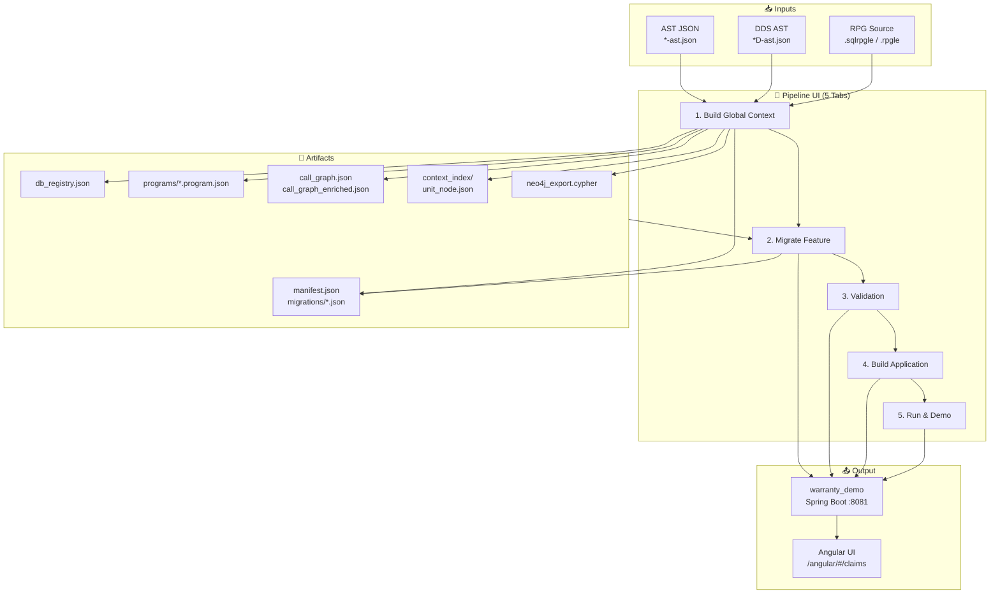
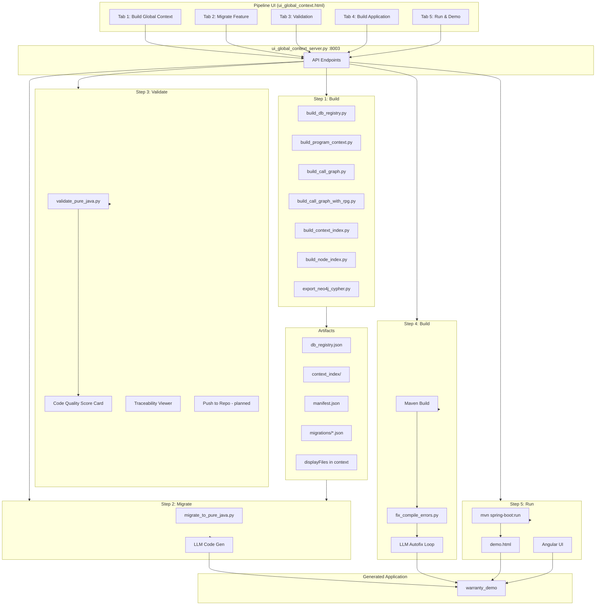
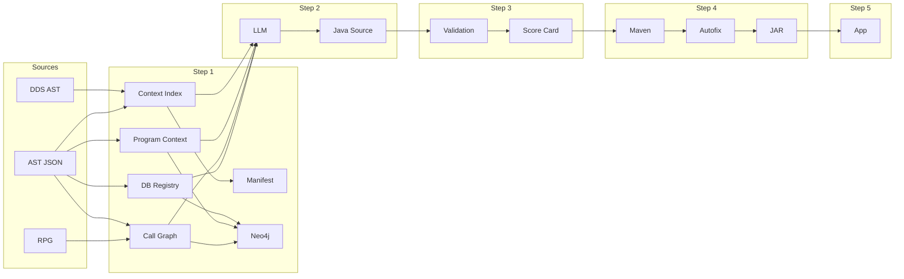
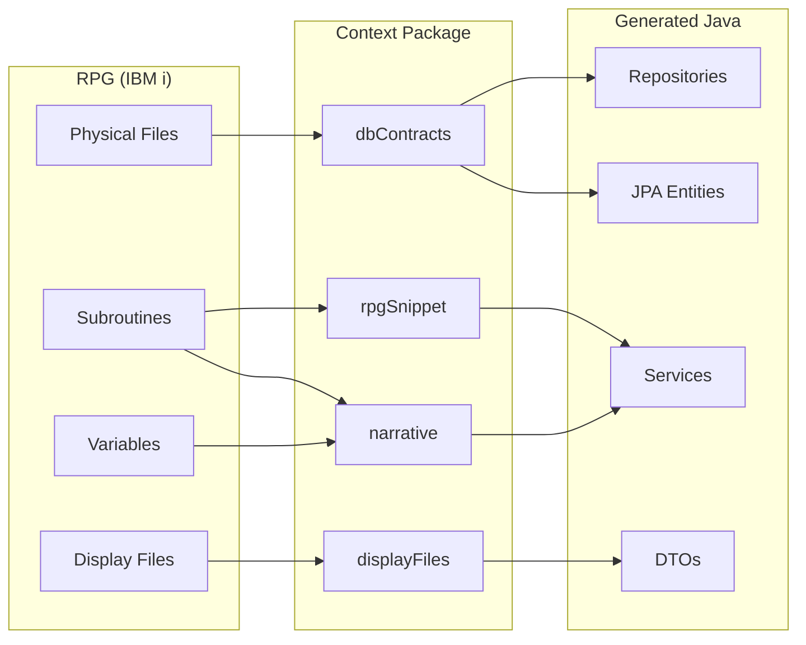

# Scania RPG-to-Java Migration Pipeline — Architecture & Client Documentation

**Version:** 2.0  
**Date:** February 2026  
**Audience:** Client team, stakeholders, and technical reviewers

---

## Table of Contents

1. [Executive Summary](#1-executive-summary)
2. [High-Level Architecture & Diagrams](#2-high-level-architecture--diagrams)
3. [The 5 Pipeline Tabs (Expanded)](#3-the-5-pipeline-tabs-expanded)
4. [Manifest Files](#4-manifest-files)
5. [Code Quality Score Card](#5-code-quality-score-card)
6. [Push to Test Server & Test Criteria](#6-push-to-test-server--test-criteria)
7. [Display Files & Angular UI](#7-display-files--angular-ui)
8. [Application-Level Migration](#8-application-level-migration)
9. [Artifacts, APIs & Quick Start](#9-artifacts-apis--quick-start)
10. [Related Documentation](#10-related-documentation)

---

## 1. Executive Summary

This document describes the **architecture** of the Scania RPG-to-Java migration pipeline. The pipeline migrates IBM i RPG (RPGLE/SQLRPGLE) programs to **Pure Java Spring Boot** applications, with a focus on the **Warranty Claim Processing** domain.

**Key capabilities:**
- **AST (Abstract Syntax Tree)** exports from PKS Systems tooling
- **Global context** (DB registry, program context, call graph) for enterprise-scale migration
- **LLM-assisted code generation** for RPG → Java translation
- **Automated validation** with Code Quality Score Card
- **LLM-based compile error fixing** (autofix loop)
- **Display file (DSPF) support** for UI-aware migration and Angular UI
- **Manifest-based traceability** (RPG ↔ Java)
- **Push to test server** and test case generation (planned)

---

## 2. High-Level Architecture & Diagrams

### 2.1 Complete System Architecture (ASCII)

```
┌─────────────────────────────────────────────────────────────────────────────────────────────┐
│                    SCANIA RPG-TO-JAVA MIGRATION PIPELINE                                       │
├─────────────────────────────────────────────────────────────────────────────────────────────┤
│                                                                                               │
│  INPUTS                          GLOBAL CONTEXT                         PIPELINE UI          │
│  ┌─────────────┐                 ┌─────────────────────┐                ┌─────────────────┐  │
│  │ AST JSON    │                 │ db_registry.json    │                │ Tab 1: Build    │  │
│  │ *-ast.json  │────────────────▶│ programs/*.json    │◀───────────────│ Global Context  │  │
│  │ *D-ast.json │                 │ call_graph*.json    │                ├─────────────────┤  │
│  └─────────────┘                 │ context_index/      │                │ Tab 2: Migrate   │  │
│  ┌─────────────┐                 │ neo4j_export.cypher │                │ Feature         │  │
│  │ RPG Source  │────────────────▶│ migrations/*.json   │                ├─────────────────┤  │
│  │ .sqlrpgle   │                 │ manifest.json       │                │ Tab 3: Validate  │  │
│  └─────────────┘                 └─────────────────────┘                │ Tab 4: Build     │  │
│         │                                 │                              │ Tab 5: Run &    │  │
│         │                                 │                              │ Demo            │  │
│         │                                 │                              └────────┬────────┘  │
│         │                                 │                                       │           │
│         │                                 │                              ui_global_context_   │
│         │                                 │                              server.py :8003      │
│         │                                 │                                       │           │
│         ▼                                 ▼                                       ▼           │
│  ┌───────────────────────────────────────────────────────────────────────────────────────┐  │
│  │  OUTPUT: warranty_demo (Spring Boot)  │  Port 8081  │  PostgreSQL (RDS)  │  demo.html    │  │
│  │  Angular UI  │  Swagger  │  REST APIs  │  JPA Entities  │  Services  │  Repositories   │  │
│  └───────────────────────────────────────────────────────────────────────────────────────┘  │
│                                                                                               │
└─────────────────────────────────────────────────────────────────────────────────────────────┘
```

### 2.2 Architecture Diagram (Mermaid)



### 2.3 Component Block Diagram (All Pieces)



### 2.4 End-to-End Data Flow



### 2.5 RPG → Java Transformation



---

## 3. The 5 Pipeline Tabs (Expanded)

### 3.1 Overview

| Tab | Name | Purpose | Key Outputs |
|-----|------|---------|-------------|
| **1** | Build Global Context | Build DB registry, program context, call graph, context index, manifests, Neo4j export | `global_context/`, `context_index/`, `neo4j_export.cypher` |
| **2** | Migrate Feature | Generate Java from RPG using LLM (code gen only) | `warranty_demo/src/main/java/`, migration manifest |
| **3** | Validation | Validate structure, DB mapping, logic completeness, traceability; Code Quality Score Card | JSON validation report, score card |
| **4** | Build Application | Maven build + LLM autofix for compile errors | Compiled JAR, test results |
| **5** | Run & Demo | Start Spring Boot app, open demo UI | Running app at http://localhost:8081 |

---

### 3.2 Tab 1: Build Global Context (Expanded)

**Purpose:** Create a persistent, structured view of all ASTs and RPG programs for enterprise-scale migration. This is the foundation for all subsequent steps.

**UI inputs:**
- **AST Directory:** Path to `*-ast.json` files (e.g. `JSON_ast/JSON_20260227`)
- **RPG Directory:** Path to RPG source (e.g. `PoC_HS1210` or `HS1210D_20260216`)

**Sub-steps (executed in order):**

| # | Script | Output | Description |
|---|--------|--------|-------------|
| 1 | `build_db_registry.py` | `global_context/db_registry.json` | Merged registry of all DB files (physical files, columns) across ASTs. Single source of truth for schema. |
| 2 | `build_program_context.py` | `global_context/programs/*.program.json` | Per-program metadata: nodes, symbols, shared variables |
| 3 | `build_call_graph.py` | `global_context/call_graph.json` | AST-based caller→callee relationships |
| 4 | `build_call_graph_with_rpg.py` | `global_context/call_graph_enriched.json` | Call graph enriched with RPG callee names (requires RPG dir) |
| 5 | `build_context_index.py` | `context_index/<unit>_<node>.json` | Per-node context packages (narrative, RPG snippet, dbContracts, **displayFiles**) |
| 6 | `build_node_index.py` | `node_index/` | Fine-grained node index for traceability |
| 7 | `export_neo4j_cypher.py` | `global_context/neo4j_export.cypher` | Knowledge graph export for Neo4j |

**Display file inclusion:**
- `build_context_index.py` looks for `{unitId}D-ast.json` (e.g. `HS1210D-ast.json`) in the AST directory
- Extracts `uiContracts.displayFiles` (recordFormats, fields)
- Matches `sym.dspf.*` references from each node’s `sem` and AST edges
- Adds `displayFiles` array to each context package

**API:** `POST /api/build-global-context`  
**Body:** `{ "astDir": "JSON_ast/JSON_20260227", "rpgDir": "/path/to/PoC_HS1210" }`

**Prerequisites:** AST files must be present. RPG directory is optional for enriched call graph.

**UI behavior:** "Discover Directories" populates AST/RPG dropdowns. "Build Global Context" runs all 7 sub-steps; output shown in pre block. Neo4j export written to `global_context/neo4j_export.cypher`.

---

### 3.3 Tab 2: Migrate Feature (Expanded)

**Purpose:** Generate Pure Java code from RPG for a selected feature (program + entry node). Code generation only; build/compile errors are fixed in Tab 4.

**UI inputs:**
- **Program ID:** e.g. `HS1210`
- **Entry Node ID:** e.g. `n404` (subroutine/procedure)
- **RPG Directory:** (optional) for RPG source resolution

**Process (detailed):**

1. **Load program context** from `global_context/programs/<programId>.program.json`
2. **Load call graph** (enriched or plain) from `call_graph_enriched.json` or `call_graph.json`
3. **Compute node slice:** BFS from entry node over CALLS edges → all reachable nodes
4. **Build context file list:** For each node in slice, `context_index/<unit>_<node>.json`
5. **For each context file:** Run `migrate_to_pure_java.py` with `--target-project warranty_demo`
6. **LLM prompt** includes: narrative, rpgSnippet, dbContracts, **displayFiles** (uiContracts)
7. **LLM generates:** domain entities, repositories, services, controllers, DTOs
8. **Write migration manifest** to `global_context/migrations/<programId>_<entryNodeId>_<timestamp>.json`

**Output:** Java files under `warranty_demo/src/main/java/com/scania/warranty/`

**API:** `POST /api/migrate-feature`  
**Body:** `{ "programId": "HS1210", "entryNodeId": "n404", "rpgDir": "..." }`

**Note:** Large nodes (e.g. n404 ~23k lines) may take 15–25 minutes. Progress is streamed via chunked response.

**UI behavior:** "Refresh Feature List" loads programs from global context. Select Program + Feature, then "Migrate Feature". Progress messages appear during migration. Manifest path and generated files shown on success.

---

### 3.4 Tab 3: Validation (Expanded)

**Purpose:** Validate generated Java against structure, DB mapping, logic completeness, and traceability. Produces a **Code Quality Score Card**.

**UI inputs:**
- **Project:** `warranty_demo` (default)
- **Program / Feature:** For traceability (manifest lookup)

**Validation categories (via `validate_pure_java.py`):**

| Category | Checks | Details |
|----------|--------|---------|
| **Structure** | Directory layout | Maven layout (`src/main/java`), layer directories (domain/service/repository/dto/web) |
| **Packages** | Package declarations | Match directory structure |
| **Database Mapping** | Column mapping | All dbContract columns mapped to entity fields |
| **Architecture** | Layered, DDD | No anemic domain, proper separation |
| **Syntax** | Compilation | Java compiles (javac) |
| **Modern Java** | Best practices | Records, Streams, Optional, Enums |
| **Logic Completeness** | No stubs | No stub methods, no empty loops, expected vs implemented |

**Traceability:** Java ↔ RPG line mapping via `@origin` comments. Select a Java file and hover over a line to preview the source RPG block.

**Push to Repository (planned):** Button enabled when validation PASSED. Pushes to `scania-java-v2.git`.

**API:** `POST /api/validate`  
**Body:** `{ "projectDir": "warranty_demo", "programId": "HS1210", "entryNodeId": "n404" }`

**UI behavior:** Select Program/Feature for traceability. "Run Validation" shows score card (Structural, Semantic, Behavioral), issues, warnings. Java ↔ RPG traceability: select Java file, hover over `@origin` lines to see RPG source.

---

### 3.5 Tab 4: Build Application (Expanded)

**Purpose:** Compile the generated Java application and fix compilation errors automatically using an LLM-based autofix loop.

**Process (detailed):**

1. **Initial build:** `mvn clean compile` (or `mvn clean package -DskipTests`)
2. **Filename autofix:** If errors like "interface X should be declared in file X.java" → rename or delete misnamed file, rebuild
3. **LLM autofix loop (up to 4 passes):**
   - If compile errors remain → call `fix_compile_errors.py` with build output
   - LLM analyzes errors and proposes fixes
   - Apply fixes, rebuild
   - Repeat until success or max 4 passes
4. **Test run:** `mvn test` for test summary

**API:** `POST /api/build-application`  
**Body:** `{ "projectDir": "warranty_demo" }`

**UI behavior:** Shows build context (Java file count, last migrated). "Build Application" runs Maven; on compile errors, autofix loop runs (up to 4 LLM passes). Test summary shown when tests exist.

---

### 3.6 Tab 5: Run & Demo (Expanded)

**Purpose:** Start the migrated Spring Boot application and demonstrate functionality.

**Database:** AWS RDS PostgreSQL only (no H2). Tests use H2 via profile `test`.

**Access points:**

| URL | Description |
|-----|-------------|
| http://localhost:8081/demo.html | Demo page |
| http://localhost:8081/angular/ | Angular UI (claims list) |
| http://localhost:8081/swagger-ui.html | Swagger API docs |

**API:** `POST /api/run-application`  
**Body:** `{ "profile": "rds" }` (RDS is the only runtime database)

**UI behavior:** "Run Application" starts Spring Boot in background with RDS. "Open Demo" opens http://localhost:8081/demo.html. "Check Status" verifies app is running. Quick API test buttons for `/api/demo/migrated-queries` and `/api/claims/search`.

---

## 4. Manifest Files

### 4.1 Context Index Manifest (`context_index/manifest.json`)

**Produced by:** `build_context_index.py` (Step 1)

**Purpose:** Index of all migratable nodes across all AST programs.

**Structure:**
```json
{
  "entries": [
    {
      "unitId": "HS1210",
      "nodeId": "n404",
      "kind": "Subroutine",
      "name": "...",
      "dbContracts": ["HSG71LF2", "HSAHKLF3", ...],
      "contextPath": "context_index/HS1210_n404.json"
    }
  ]
}
```

**Used by:** UI Program/Feature dropdowns.

---

### 4.2 Migration Manifest (`global_context/migrations/<programId>_<entryNodeId>_<timestamp>.json`)

**Produced by:** `ui_global_context_server.py` after each Migrate Feature run (Step 2)

**Purpose:** Audit trail and traceability for a specific migration run.

**Structure:**
```json
{
  "programId": "HS1210",
  "unitId": "HS1210",
  "entryNodeId": "n404",
  "nodesInSlice": [{ "nodeId": "n404", "kind": "Subroutine", "name": "...", "range": {...} }],
  "contextFiles": ["context_index/HS1210_n404.json"],
  "dbFiles": [{"name": "HSG71LF2", "library": "..."}],
  "generatedFiles": ["domain/Claim.java", "service/ClaimService.java", ...],
  "primaryServiceFile": "service/ClaimService.java",
  "rpgSnippet": "...",
  "summary": "Migrated feature starting at HS1210 n404 with 1 node(s); DB files involved: ...",
  "runs": [{ "contextFile": "...", "returnCode": 0, ... }]
}
```

**Used by:** Validation (traceability), Build Application (last-migrated context), Traceability viewer.

---

## 5. Code Quality Score Card

**Produced by:** `validate_pure_java.py` (Tab 3)

### Category Scores

| Category | Weight | Description | Required |
|----------|--------|-------------|----------|
| **Structural** | 40% | Directory structure, package declarations | Yes |
| **Semantic** | 40% | DB mapping, architecture, domain modeling | Yes |
| **Behavioral** | 20% | Syntax, modern Java | No |

### Overall Status

| Score | Status |
|-------|--------|
| ≥ 95% | **PASSED** |
| ≥ 80% | **WARNING** |
| < 80% | **FAILED** |

### Score Card Output (JSON)

```json
{
  "overall_score": 92.5,
  "status": "WARNING",
  "categories": {
    "structural": { "score": 100, "description": "...", "required": true },
    "semantic": { "score": 90, "description": "...", "required": true },
    "behavioral": { "score": 85, "description": "...", "required": false }
  },
  "results": { "structure": {...}, "packages": {...}, ... },
  "issues": [],
  "warnings": ["..."],
  "passed_checks": ["✓ ..."]
}
```

---

## 6. Push to Test Server & Test Criteria

*(Planned — see `PIPELINE_TEST_AND_PUSH_PLAN.md`)*

### Push After Validation

**When:** Validation (Tab 3) passes (PASSED).

**What:** Push `warranty_demo/` to `https://github.com/bhaveshchandrajha/scania-java-v2.git`  
**Branch:** `migration/HS1210_<timestamp>`  
**Credentials:** `GITHUB_TOKEN` or `GIT_PUSH_TOKEN`

### Test Case Generation

**Output:** Test classes under `warranty_demo/src/test/java/com/scania/warranty/`:
- `ClaimCreationWorkflowTest.java`
- `ClaimFailureAssignmentTest.java`
- `ClaimTransmissionTest.java`

### Test Criteria

| Phase | Scenarios |
|-------|-----------|
| **Phase 1 – Claim Creation** | Valid workorder, workorder structure validation, repair date rule, duplicate prevention, initial status |
| **Phase 2 – Failure Assignment** | Mandatory failure, max 9 failures, mandatory fields |
| **Phase 3 – Transmission** | Send validation, success, failure |

---

## 7. Display Files & Angular UI

### Display File (DSPF) Flow

```
DDS Display File (HS1210D.DSPF)
        │
        ▼
DDS AST (HS1210D-ast.json) → uiContracts (recordFormats, fields)
        │
        ├──▶ Context package (displayFiles) → migrate_to_pure_java → Java DTOs, services
        │
        └──▶ UI Schema (HS1210D.json) → Angular components
```

### Warranty UI (Angular)

**Location:** `warranty-ui/`

**Screens:** Welcome, HS1210D (claims list)

**Build:** `cd warranty-ui && npm run build:spring` → copies to `warranty_demo/src/main/resources/static/angular/`

**Access:** http://localhost:8081/angular/#/claims

---

## 8. Application-Level Migration

**Current:** Migrate Feature uses BFS from entry node → migrates a **feature slice** (multiple nodes) into `warranty_demo`.

**Gap:** Program-level shared variables and copybooks not fully modeled. See `ENTERPRISE_MIGRATION_DESIGN.md`.

---

## 9. Artifacts, APIs & Quick Start

### Key Artifacts

| Path | Description |
|------|-------------|
| `JSON_ast/` | AST JSON exports |
| `global_context/db_registry.json` | Canonical DB registry |
| `global_context/programs/*.program.json` | Per-program context |
| `global_context/call_graph*.json` | Call graph |
| `global_context/neo4j_export.cypher` | Knowledge graph |
| `context_index/<unit>_<node>.json` | Per-node context packages |
| `context_index/manifest.json` | Context index |
| `global_context/migrations/*.json` | Migration manifests |
| `warranty_demo/` | Generated Spring Boot application |

### API Reference

| Method | Path | Purpose |
|--------|------|---------|
| GET | `/` | Serve UI |
| GET | `/api/health` | Health check |
| GET | `/api/discover-directories` | List AST/RPG directories |
| GET | `/api/list-programs` | List programs |
| POST | `/api/build-global-context` | Tab 1 |
| POST | `/api/migrate-feature` | Tab 2 |
| POST | `/api/validate` | Tab 3 |
| POST | `/api/build-application` | Tab 4 |
| POST | `/api/run-application` | Tab 5 |

### Quick Start

1. **Prerequisites:** Python 3.x, Java 17+, Maven, `ANTHROPIC_API_KEY`
2. **Start:** `UI_PORT=8003 python3 ui_global_context_server.py`
3. **Open:** http://127.0.0.1:8003/
4. **Run:** Tab 1 → Build → Tab 2 → Migrate → Tab 3 → Validate → Tab 4 → Build → Tab 5 → Run & Demo
5. **Demo:** http://localhost:8081/demo.html

### Warranty Domain Model

| RPG File | Java Entity |
|----------|-------------|
| HSG71LF2 | `Claim` |
| HSAHKLF3 | `Invoice` |
| HSAHWPF | `WorkPosition` |
| HSG73PF | `ClaimError` |
| HSG70F | `ReleaseRequest` |
| HSFLALF1 | `HSFLALF1` |

---

## 10. Related Documentation

| Document | Description |
|----------|-------------|
| `PIPELINE_TEST_AND_PUSH_PLAN.md` | Test generation, repo push |
| `ENTERPRISE_MIGRATION_DESIGN.md` | Shared state, global view |
| `NODES_AND_CLAIM_PROCESSING.md` | Nodes, HS1210 |
| `docs/SCHEMA_MAPPING.md` | DB2 schema → JPA mapping |
| `CUSTOMIZE.md` | Customizing the generated app |

---

*Document generated for client team review. For questions, contact the migration team.*
